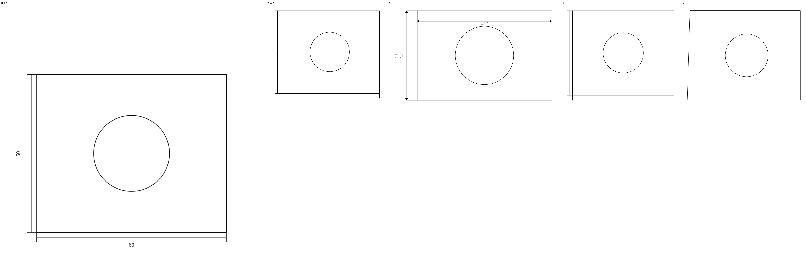
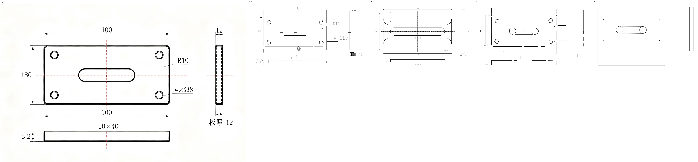
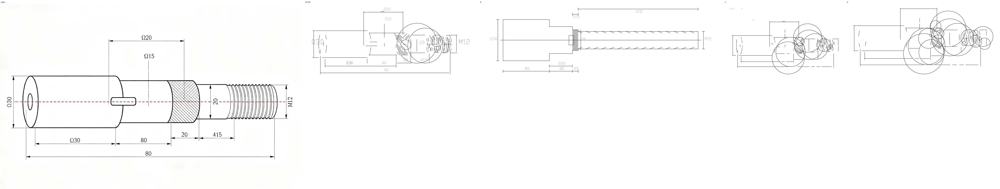
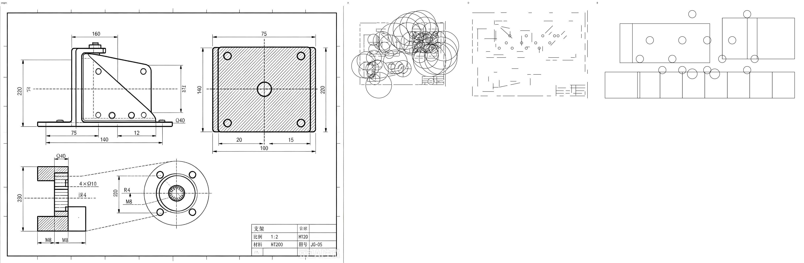
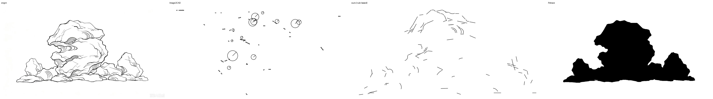
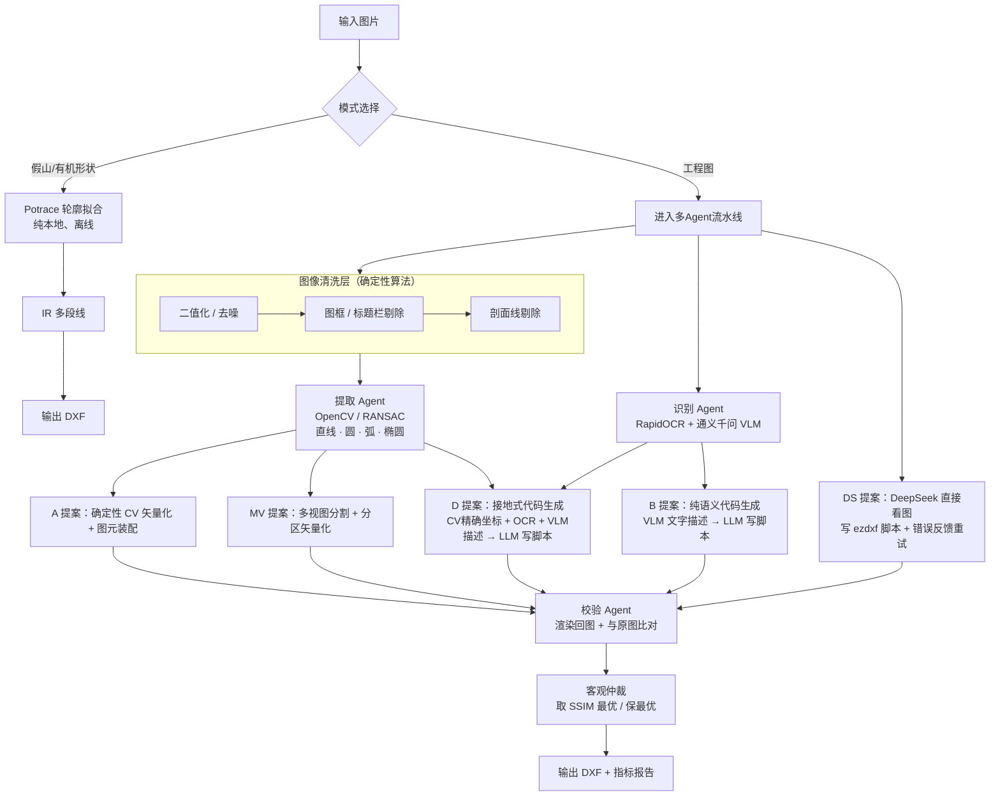

# cad-agent · 图纸矢量化系统（双模式）

> 把**黑白线稿图**自动转成**可编辑的 DXF 矢量文件**。
> 核心思路：**精确的事交给算法，理解的事交给 AI，对错由渲染回图的客观指标裁决。**

**两种模式（界面里手动选，最稳）：**

| 模式 | 适用 | 引擎 |
|---|---|---|
| **① 工程图** | 机械/工程图（直线、圆、圆弧、尺寸标注） | 多Agent集成流水线（CV + VLM + 代码生成 + 客观仲裁） |
| **② 假山/有机形状** | 假山、植物、地形等自由曲线 | Potrace 轮廓拟合（纯本地，离线） |

一键启动：双击 `启动.bat`（图形界面，上传图片 → 选模式 → 出 DXF）。

---

## 一、问题背景

传统 CAD 制图中，"把图片/草图重新画成 CAD 矢量图"是完全的重复劳动：人工描图慢、易错、成本高。

- **传统光栅转矢量工具**（R2V、img2cad）只会"描像素边界"，输出成千上万条碎线段，不懂"这是直线/圆/标注"。
- **纯大模型**能"看图写代码"，但**给不出精确坐标**，画出来是"大概像"，尺寸对不上。

本项目的目标不是"全自动一键出完美 CAD"（业界尚未解决），而是做**辅助级矢量化**：
AI 出 70~80% 的初稿，人工再精修。这也是专利里的定位。

---

## 二、效果预览

**模式① 工程图**：每张图从左到右 —— **原图 / A臂(CV) / B臂(纯语义) / C臂 / D臂(融合)**

| 简单图（方+圆） | 中等图（三视图） |
|---|---|
|  |  |

| 较难图（轴+螺纹） | 装配图（4视图+图框） |
|---|---|
|  |  |

**模式② 假山**：原图 / Image2CAD / 规则管线 / **Potrace**



> 假山是**自由曲线**：Image2CAD（机械图管线）几乎提取不出东西，规则几何管线也断断续续，
> **只有 Potrace 能完整还原轮廓**（253 条曲线 → 101 个图元，2 秒）。

---

## 三、系统架构



**一句话流程**：
清洗干扰 → 算法量出精确几何 → **四条路线各自出图** → 把每个结果渲染回图片和原图比 → 谁最像用谁。

---

## 四、核心设计决策

| # | 决策 | 为什么 |
|---|---|---|
| 1 | **精确的事交给算法，理解的事交给 AI** | VLM 给不出精确坐标；算法不懂"这是标注"。各干各擅长的 |
| 2 | AI **不直接画图**，而是写脚本/输出中间表示，由确定性代码落地 | 避免幻觉，"坐标是算出来的，不是猜的" |
| 3 | 校验信号必须**客观**（渲染回图 + 像素/结构指标） | 不能让 AI 自己判断自己对；必须有外部裁判 |
| 4 | **保最优机制**：每轮结果都和历史最优比，只留更好的 | Agent 调参可能变差，但最终输出**永不差于基线** |
| 5 | **多臂集成 + 客观仲裁** | 不同难度的图，最优路线不同；自动选当轮最优，避免单路线翻车 |
| 6 | **图元装配层**：共线合并 / 角度吸附 / 端点吸附 / 矩形装配 | 把"碎线"变成"结构化形状"，输出更干净、可编辑（如 4 条边 → 闭合矩形） |

---

## 五、技术栈

| 层 | 技术 |
|---|---|
| 语言 | Python 3.14 |
| 图像/CV | OpenCV 5.0、scikit-image、NumPy、SciPy |
| 矢量化 | HoughLinesP、HoughCircles（+圆周覆盖度验证）、Kasa 圆/弧最小二乘拟合、椭圆拟合（+覆盖度验证）、图元装配 |
| CAD | ezdxf（生成 DXF）、matplotlib（DXF 渲染回图） |
| OCR | RapidOCR（ONNX，本地离线，支持旋转文字） |
| 大模型 | 通义千问 qwen-vl-max（视觉理解）、**DeepSeek `deepseek-chat`（看图直接写代码 + 代码生成/决策）** |
| 编排 | LangGraph（状态图 + 校验回环） |
| 中间表示 | Pydantic 定义的 JSON-IR（AI 与代码的契约） |

---

## 六、目录结构

```
cad-agent/
├─ gui.py                 图形界面（双模式：工程图 / 假山）★ 双击 启动.bat
├─ core/
│  ├─ graph.py            LangGraph 多Agent 编排（识别→提取→校验→Leader回环）
│  ├─ ensemble.py         集成流水线（多臂提案 + 客观仲裁）★ 工程图入口
│  ├─ rockery.py          假山/有机形状通道（Potrace → IR → DXF）★ 假山入口
│  ├─ assemble.py         图元装配层（共线合并/角度吸附/矩形装配）
│  ├─ multiview.py        多视图分割（按空白切视图、分区矢量化）
│  ├─ calibrate.py        比例尺校准（标注反推 mm/px → 真实尺寸 DXF）
│  ├─ pipeline.py         单臂确定性流水线
│  └─ config.py           .env 配置读取
├─ agents/
│  ├─ recognizer.py       识别Agent（OCR + VLM）
│  ├─ extractor.py        提取Agent（矢量化 + OCR文字合成）
│  ├─ verifier.py         校验Agent（渲染 + 客观比对 + 保最优）
│  ├─ leader.py           Leader（LLM决策收敛/回环）
│  └─ codegen_agent.py    代码生成Agent（接地/纯语义两种模式）
├─ vectorize/
│  ├─ preprocess.py       二值化/去噪/骨架化/颜色分离
│  ├─ cleaners.py         图框·标题栏·剖面线·尺寸线剔除
│  ├─ vectorize.py        直线/圆/圆弧检测（参数可调）
│  └─ arcs.py             Kasa 圆拟合 + 圆弧提取
├─ emit/                  JSON-IR → DXF
├─ render/                DXF → 图片（校验用）
├─ datagen/              合成数据生成器（DXF→线稿，自带标准答案）
├─ eval/                 指标（IoU/Dice/SSIM/Chamfer）+ 批量评测
├─ experiments/           A/B/C/D/E 对照实验
├─ tools/                 LLM/VLM/OCR/代码执行器/图片IO
├─ third_party/Image2CAD/ 开源对照项目（已从 OpenCV3.4 移植到 OpenCV5，见其 PATCHES.md）
├─ docs/                  项目故事、实验记录、图
├─ tools/trace_potrace.py 假山 Potrace 试跑脚本
├─ 启动.bat               一键启动图形界面
└─ cli.py                 命令行入口
```

---

## 七、快速开始

```bash
# 1. 环境（Windows + Python 3.14，已实测）
python -m venv .venv
.venv\Scripts\python.exe -m pip install -r requirements.txt -i https://pypi.tuna.tsinghua.edu.cn/simple

# 2. 配置密钥（复制 .env.example 为 .env，填入 DeepSeek / 通义千问 key）
copy .env.example .env

# 3. 图形界面（推荐）：双击 启动.bat，或
python gui.py

# 命令行方式
python cli.py ensemble 你的图.jpg        # 工程图：多Agent集成
python cli.py calibrate 你的图.jpg --out out   # 用尺寸标注校准比例尺 → 真实尺寸 DXF
python -m tools.trace_potrace 假山.jpg    # 假山：Potrace 轮廓

# 其它命令
python cli.py gen --n 30                 # 生成合成数据集
python cli.py run 图.png --out out       # 单张确定性矢量化
python cli.py eval                       # 合成集评测
python -m experiments.run_compare --arms A,B,C,D,E   # 对照实验
```

---

## 八、评测方法

统一用「**把生成结果渲染回图片，与原图逐像素比对**」：

| 指标 | 含义 |
|---|---|
| IoU / Dice | 线段像素重合度（带容差膨胀） |
| **SSIM** | 结构相似度（主指标） |
| Chamfer | 双向平均最近距离（越小越好） |
| 实体数 | 输出图元数量（衡量是否简洁、有无过度切分） |

评测集：**合成数据**（ezdxf 生成，自带精确标准答案）+ **真实豆包生成图**（4 张，覆盖简单→装配图）。

---

## 九、实验结果

### 9.1 真实图：集成流水线（多臂 + 仲裁）

| 图 | A(CV) | D(接地) | B(语义) | **DS(DeepSeek直画)** | **仲裁选中** |
|---|---|---|---|---|---|
| real01 简单 | 0.829 | **0.835** | 0.826 | 0.816 | D (0.835) |
| real02 三视图 | 0.757 | — | 0.749 | **0.766** | **DS (0.766)** |
| real03 轴类 | 0.789 | **0.792** | 0.709 | 0.770 | D (0.792) |
| real04 装配图 | 0.531 | 0.532 | **0.632** | 0.487 | **B (0.632)** |
| **平均** | 0.727 | — | 0.729 | 0.710 | **0.756** |

**平均最佳 0.756**（加 DeepSeek 臂后从 0.729 提升）；简单/中等图 0.75~0.84，
复杂装配图 real04 从 0.53 提升到 **0.63**（B 臂+仲裁）。

### 9.2 对照实验：A/B/C/D/E + DS 六条路线

在真实图上对比多种技术路线（详见 `docs/实验记录.md`）：

| 臂 | 做法 | 结论 |
|---|---|---|
| A | CV 精确几何 + LLM 决策回环 | 稳定、可复现；复杂图输出碎线多 |
| B | VLM 文字 → LLM 写 Python → 自校验 | 输出简洁、抗干扰；**无精确坐标、波动大**；real04 夺冠 |
| C | CV 坐标 + OCR 喂 LLM（不克制） | 照抄碎线段，效果一般 |
| D | **融合**：CV 坐标 + VLM 语义 + "只画几何"约束 | **CV 可靠时最优**（real01/03 夺冠） |
| **DS** | **DeepSeek 直接看图写 ezdxf 脚本 + 错误反馈重试** | 快、稳、能夺冠（real02）；"整体生成"路线 |
| **MV** | 多视图分割：按空白把视图切开、各自矢量化再合并 | 对多视图图有增益（real02），对单视图易误切；作为可选臂，由仲裁决定是否采用 |
| E | **集成仲裁**：跑全部提案，渲染比优 | **平均最优，且保证不下于当轮最优** |

**关键发现**：
- 接地式生成（D）在 CV 可靠时最佳；纯语义生成（B）在 CV 失效时更稳 →
  **不能只看单一路线**，因此设计**集成 + 客观仲裁**
- **DeepSeek 具备视觉能力**（用 `deepseek-chat` 通道），可直接看图写代码；
  给它 ezdxf API 用法 + 错误反馈重试后，脚本成功率大幅提升
- 大模型有随机性，**保最优 + 仲裁**是工程上必须的保险

### 9.3 算法清洗的增益（确定性 CV 通道）

| 图 | 清洗前 | 清洗后 |
|---|---|---|
| real01 | 0.811 | 0.827 |
| real02 | 0.732 | 0.755 |
| real03 | 0.761 | 0.786 |
| real04 | 0.380 | 0.529 |

关键算法：**圆周覆盖度验证**（real04 假圆 54→7）、**尺寸线剔除**（real03 实体 118→68）、
**图框/标题栏剔除**、**多方向剖面线剔除**、**椭圆检测**（带覆盖度验证）、**图元装配**
（共线合并 / 角度吸附 / 矩形装配）、Hough 阈值优化。

**比例尺校准**：用 OCR 到的尺寸标注 + 最近线段长度反推 `mm/px`，中位数抗离群，
实现**像素图 → 真实尺寸 DXF**（real01 标注 60×50，还原包围盒 61.5×50.0 mm，误差 <3%）。

---

## 十、假山 / 有机形状通道 & 开源对照

**需求**：假山、植物、地形等**自由曲线**，规则几何管线（直线/圆/弧）和机械图管线都不适用。

**方案**：**Potrace**（`potracer`，纯 Python）——位图轮廓 → 平滑贝塞尔曲线 → IR 多段线 → DXF。
纯本地、离线、约 2 秒出结果（`core/rockery.py`）。

**同一张假山线稿的对照实验**：

| 方法 | 结果 |
|---|---|
| Image2CAD（开源机械图管线） | 几乎提取不出东西 ❌ |
| 规则几何管线（模式①） | 轮廓断续 ⚠️ |
| **Potrace（模式②）** | **完整还原轮廓 ✅** |

**关于 Image2CAD**：定位为"**开源对照基线**"，已从 **OpenCV 3.4 移植到 OpenCV 5** 并跑通
（`third_party/Image2CAD/PATCHES.md` 记录了全部改动）。但它面向**机械制图**，**不适合假山**——
这也说明"图片转CAD"没有万能方案，必须按图形类型选路线。

---

## 十一、适用范围与局限（重要）

**这个工具能做什么、不能做什么**（比"我什么都能"更专业）：

| 输入 | 适合 | 效果 |
|---|---|---|
| 简单/中等工程图（方框、圆、槽、孔、少量标注） | ✅ 模式① | SSIM 0.75~0.85，可用 |
| 假山/植物/地形等有机形状 | ✅ 模式② | 完整还原轮廓 |
| 复杂多视图装配图（图框+标题栏+剖面线+透视角） | ⚠️ 模式① | 约 **0.63**（多臂仲裁），仍属"部分重建" |

**根本原因**：复杂图的瓶颈是**检测不全**（多视图、密集剖面线抓不全）。
「图元装配层」只能规整"已抓到的"，补不回"没抓到的"；
**多臂仲裁 + 大模型整体生成（B / DS）** 能部分弥补（real04 0.53 → 0.63）。

**其它局限**：
- 依赖云 API，有成本与延迟；结果有随机性（靠"保最优"兜底）
- 椭圆已支持；**样条/自由曲线**仍无法表示

**关于"图片转CAD 工具"的结论**：没有万能方案。工程图 → 多Agent；有机形状 → Potrace。
（卖家常打包商业软件冒充"开源一键转CAD"，实测对复杂图同样无能。）

**未来工作**：
1. 多视图自动分割（按图框/视图边界分区处理）
2. 样条/自由曲线等更丰富的图元类型
3. **LoRA 微调小模型**：把"识别/决策"换成本地小模型，降本提稳
4. 引入开源 CAD 数据集（FloorPlanCAD 等）做更大规模评测

---

## 十二、项目亮点（简历版）

> **图纸矢量化多Agent协同系统**：针对"图片转可编辑CAD"的重复劳动问题，设计「算法清洗 → 精确矢量化 + 图元装配 → 多Agent协同 → 渲染回图客观仲裁」架构。通过 **A/B/C/D/E + DS 多臂对照实验**发现"接地式生成在CV可靠时最优、纯语义/大模型整体生成在CV失效时更稳"的规律，据此实现**多臂集成 + 客观仲裁**（保最优回退）；并发现 DeepSeek 具备视觉能力，可直接看图写 ezdxf 脚本。在自建评测上，简单/中等图 SSIM 达 **0.75~0.84**，复杂装配图较基线提升 **0.38→0.63**。技术栈：Python / OpenCV / RANSAC / LangGraph / ezdxf / RapidOCR / 通义千问 VLM / DeepSeek。
